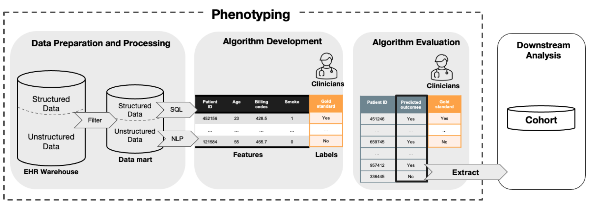

```{r setup, include = FALSE}
library(knitr)
library(tidyverse)
library(NHSRtheme)
# set default options
opts_chunk$set(echo = TRUE,
               warning = FALSE,
               message = FALSE,
               fig.width = 7.252,
               fig.height = 4,
               dpi = 300)
```


class: title-slide, left, bottom

# `r rmarkdown::metadata$title`
----
## **`r rmarkdown::metadata$subtitle`**
### `r rmarkdown::metadata$author`
### `r rmarkdown::metadata$institute`
### `r rmarkdown::metadata$date`

---

# Overview of the phenotyping process



---

class: inverse, middle, center

# Algorithm development 
<br>
<br>


### 1. Supervised learning
### 2. Semi-supervised learning 
### 3. Weakly-supervised learning 

---

# PheCAP data

```{r}
library(PheCAP)
library(tidyverse)
library(randomForestSRC)
library(PheNorm)
library(MAP)

data(ehr_data)
data <- PhecapData(ehr_data, "healthcare_utilization", "label", 0.4, patient_id = "patient_id")
data
```

---
# Prepare data for algorithm development 

### Split data into training and testing set

```{r}
train_data <- ehr_data %>% filter(patient_id %in% data$training_set)
train_x <- train_data %>% select(starts_with("COD"), starts_with("NLP"), 
                                 starts_with("main"), healthcare_utilization)
train_y <- train_data %>% select(label) %>% pull()

test_data <- ehr_data %>% filter(patient_id %in% data$validation_set) 
test_x <- test_data %>% select(starts_with("COD"), starts_with("NLP"), 
                               starts_with("main"), healthcare_utilization)
test_y <- test_data %>% select(label) %>% pull()
```

--

### Transform the features 

```{r}
train_x <- log(train_x + 1)
```

### Load functions

```{r}
source("../Rscripts/rankCor.R")
source("../Rscripts/extremeMethod.R")
source("../Rscripts/clusteringMethod.R")
source("../Rscripts/modelFitting.R")
```

---

# Supervised learning 

## 1. Penalized logistic regression 

```{r}
model_lr <- glmnet(train_x, train_y, family = "binomial", alpha = 1, nlambda = 100L, lambda.min.ratio = 1e-3)
```

<br>
<br>


## 2. Random forest 

```{r}
model_rf <- rfsrc(y ~., data = data.frame(y = train_y, x = train_x))
```

---

class: inverse, middle, center

# Semi-supervised learning 
<br>
<br>

---

# PheCAP

Two-step semi-supervised method: 
1. Feature selected by surrogates.
2. Model fitting by regressing the outcome on the linear predictor. 

```{r}
surrogates <- list(
  PhecapSurrogate(
    variable_names = "main_ICD",
    lower_cutoff = 1, upper_cutoff = 10),
  PhecapSurrogate(
    variable_names = "main_NLP",
    lower_cutoff = 1, upper_cutoff = 10),
  PhecapSurrogate(
    variable_names = c("main_ICD", "main_NLP"),
    lower_cutoff = 1, upper_cutoff = 10))

#model_phecap <- phecap_train_phenotyping_model(data, surrogates, Auto_feature)
```

---

# PASS method

```{r}

```

---

class: inverse, middle, center

# Weakly-supervised learning 
<br>
<br>

---

# PheNorm 

```{r}
data_fit <- data.frame(cbind(train_x, train_y))
model_phenorm <- PheNorm.Prob(
  nm.logS.ori = "main_ICD", 
  nm.utl = "healthcare_utilization", 
  dat = data_fit, 
  corrupt.rate = 0.3, 
  train.size = nrow(data_fit)
)
```

```{r}
head(model_phenorm$probs)
```

---

# MAP

```{r, results='hide'}
train_x <- train_data %>% select(starts_with("COD"), starts_with("NLP"), 
                                 starts_with("main"), healthcare_utilization)
data_fit <- Matrix(cbind(ICD = train_x$main_ICD, NLP = train_x$main_NLP), sparse = TRUE)
note <- Matrix(train_x$healthcare_utilization, ncol = 1, sparse = TRUE)
model_map <- MAP(mat = data_fit, note = note)
```

.pull-left[

```{r}
head(model_map$scores)
```

]

.pull-right[

```{r}
model_map$cut.MAP
```
]

---

class: inverse, middle, center

# Algorithm evaluation 

---

# Validating PheCAP model

```{r}
library(pROC)
```

```{r}
# validation <- phecap_validate_phenotyping_model(data, model_phecap)
# validation
```

```{r}
# phecap_plot_roc_curves(validation)
```

---

# Validating other models

```{r}
train_y_hat <- predict(model_lr, newx = as.matrix(train_x), s = min(model_lr$lambda), type = "response")
test_y_hat <- predict(model_lr, newx = as.matrix(test_x), s = min(model_lr$lambda), type = "response")
```


```{r}
train_y_hat <- as.vector(train_y_hat)
test_y_hat <- as.vector(test_y_hat)
validation <- validate_model(train_y, test_y, train_y_hat, test_y_hat)

validation
```


---

# Comparison

1. print auc for every method just like phenorm
2. write a function to plot the sens, spec, ppv, etc, the roc parameters, like the phentoyping paper. 

---
class: inverse, middle, center

# Review exercises and discussion

---

.left-column[
## Let's code
[15:00 mins](https://flipclock.us/#/c/0h15m0s)
]

.right-column[
### Exercise 1


### Exercise 2


### Exercise 3

- (Advanced) 
]
