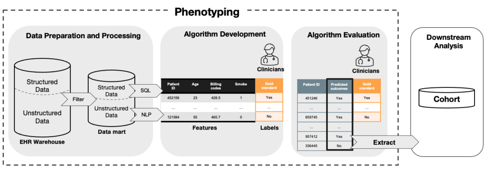

```{r setup, include = FALSE}
#https://spcanelon.github.io/xaringan-basics-and-beyond/slides/day-01-basics.html?panelset1=extra-info&panelset4=remark.js2&panelset5=nhsrtheme2&panelset6=moon-reader2&panelset7=markdown2#14
library(knitr)
library(tidyverse)
library(NHSRtheme)
# set default options
opts_chunk$set(echo = TRUE,
               warning = FALSE,
               message = FALSE,
               fig.width = 7.252,
               fig.height = 4,
               dpi = 300)
```


class: title-slide, left, bottom

# `r rmarkdown::metadata$title`
----
## **`r rmarkdown::metadata$subtitle`**
### `r rmarkdown::metadata$author`
### `r rmarkdown::metadata$institute`
### `r rmarkdown::metadata$date`

---
class: inverse, middle, center

# The goal of phenotyping

## To predict patients' disease status from <br> electronic health record data

---

# Overview of the phenotyping process



---

class: inverse, middle, center

# Data preparation and processing

---

# How to prepare the data?

Suppose we are interested in phenotyping Coronary Artery Disease (CAD), a disease that develops when the major blood vessels that supply heart become damaged or diseased.  

--

.pull-left[
### Filtering/Screening 

- From a random sample of patients in the EHR warehouse (eg. 4.6 million patients in Partner's EHR database) 

- Filter patients who are likely to have the CAD 
]

.pull-right[

]

---

# Possible filters 

.pull-left[

### Structured data

- Processed by SQL

- Filter: $\geq 1$ ICD-9 codes for CAD (410.x, 411.x, 412.x, 414.x, 413.x)

### Unstructured data

- Processed by natural language processing (NLP) software

- Filter: $\geq 1$ NLP mentions for any CAD related concepts (CAD, CAD procedures, CAD biomarkers, positive stress test)
]

.pull-right[

]

---
class: inverse, middle, center

# PheCAP data

## A public released dataset from an R package

---

# PheCAP data

Contains data prepared for phenotyping Coronary Artery Disease (CAD). 


<!--https://github.com/yihui/xaringan/blob/master/inst/rmarkdown/templates/xaringan/skeleton/skeleton.Rmd -->

https://celehs.github.io/PheCAP/

---

# Load data

```{r}
library(PheCAP)
library(tidyverse)
library(glmpath)

# Load data.
data(ehr_data)
data <- PhecapData(ehr_data, "healthcare_utilization", "label", 0.4, patient_id = "patient_id")
data
```

--
### Data overview

- 10,000 patients and 587 features.
- Label is subjective to missing. 
- Split into training and validation set. 

---

# Examine data 

```{r, eval = FALSE}
ehr_data %>% head() 
```

--


--

### Variable explanation

- Labels: "label", whether the patient has the disease, **extracted by clinicians' chart review**

--

- Features: "main_ICD", "main_NLP" refers to total number of billing codes or NLP mentions of the disease

--

- Features: "healthcare_utilization" refers to total number of notes the patient has

--

- Features: “CODx” (n = 10), “NLPx” (n = 574) refers to the counts of a specific code or NLP term, extracted by SQL or NLP

---

# Data structure for phenotyping

.pull-left[

### Labels $Y$

* Available for $n$ patients, $n = 181$
  
### Features $\mathbf{X}$

* Available for $N$ patients, $N = 10000$
* Each patient has $p$ features, $p = 587$

<br>

]

.pull-right[]

--

.pull-left[

### Porblem 1: Extreme missingness on $Y$

- $n \ll N$ so that $n/N \to 0$ as $n \to \infty$

### Problem 2: High-dimensional features

- When $n \ll p$, supervised models can suffer from overfitting

]

---

# Can we leverage information from features?

### Findings

- Feature "main_ICD" = the total number of the disease-related billing codes. 

--

- The more the diesase-related codes, the more **likely** the patient has the disease.

--

- The assumption should remain the same for feature "main_NLP"

--

<br>
<br>

### Let's plot the density of "main_ICD" stratified by patients having the disease or not!

---

# Density of ICD main

--

.pull-left[
```{r}
ehr_data %>%
  filter(!is.na(label)) %>%
  mutate(disease = factor(label)) %>%
  ggplot(aes(x = main_ICD)) +
  geom_density(aes(color = disease))
```
]

--

.pull-right[
```{r}
ehr_data %>%
  filter(!is.na(label)) %>%
  mutate(disease = factor(label)) %>%
  ggplot(aes(x = log(main_ICD+1))) +
  geom_density(aes(color = disease))
```
]

--

### The more main_ICD the patient has, the more likely s/he has the disease! 

---

# Other potential indicators

--

.pull-left[
### log(main_NLP + 1)

```{r}
ehr_data %>%
  filter(!is.na(label)) %>%
  mutate(disease = factor(label)) %>%
  ggplot(aes(x = log(main_NLP+1))) +
  geom_density(aes(color = disease))
```
]

--

.pull-right[
### log(main_NLP + main_ICD + 1)

```{r}
ehr_data %>%
  filter(!is.na(label)) %>%
  mutate(disease = factor(label)) %>%
  ggplot(aes(x = log(main_ICD+main_NLP+1))) +
  geom_density(aes(color = disease))
```
]

---

# New data structure for phenotyping

.pull-left[

### Labels $Y$

* Available for $n$ patients, $n = 181$
  
### Features $\mathbf{X}$

* Available for $N$ patients, $N = 10000$

### Surrogate features $\mathbf{S}$

* Available for $N$ patients, $N = 10000$
* Can predict $Y$ with moderate precision
* $S_{NLP} = \text{main_NLP}$, 
  $S_{ICD} = \text{main_ICD}$,
  $S_{ICDNLP} = \text{main_ICD + main_NLP}$

<br>
<br>

]

.pull-right[]

---

# Challenges of the data 

1. Extreme missingness on $Y$: $n \ll N$ so that $n/N \to 0$ as $n \to \infty$

2. High-dimensional features: when $n \ll p$, supervised models can suffer from overfitting

<br>
<br>

--

# Opportunities of using surrogate features

1. Feature selection to reduce $p$

2. Algorithm development with limited $Y$

3. Algorithm validation with limited $Y$

<br>
<br>

--

### Opportunity 2 and 3 will be covered in the next module! 

---
class: inverse, middle, center

# Feature selection
<br>
<br>


### 1. Rank correlation (Yu et al. 2015)
### 2. Tail method (Yu et al. 2017)
### 3. Clustering method (Gronsbell et al. 2019)

---

# Prepare data for feature selection

### Prepare surrogates

```{r}
sicd <- log(ehr_data$main_ICD + 1)
snlp <- log(ehr_data$main_NLP + 1)
```

### Prepare features to be selected

```{r}
x <- data.matrix(ehr_data %>% select(starts_with("COD") | starts_with("NLP")))
```

### Transform the features

```{r}
x <- log(x + 1)
```

### Load functions

```{r}
source("../../script/rankCor.R")
source("../../script/extremeMethod.R")
source("../../script/clusteringMethod.R")
source("../../script/modelFitting.R")
```

---

# 1. Rank correlation (AFEP)

#### Motivation: 

- Select features that are highly related to surrogates. 

--

#### Method: 

- Select feature $\mathbf{X}_j$ if the absolute rank correlation between $(S, \mathbf{X}_j)$ > threshold, $j = 1, \dots, p$ 
- where $S$ is $S_{NLP}$ and $\mathbf{X}_j$ is the count of medical term $j$ mentioned.


#### Implementation:

Default threshold = 0.15

```{r}
# AFEP_select <- rankCor(snlp, x, threshold = 0.15)
# colnames(x)[AFEP_select]
```

---

# 2. Tail method (SAFE)

#### Motivation (Extreme assumption): 

- Patients with **high** main ICD or NLP mentions generally have the phenotype.
- Patients with **extremely** low counts are unlikely to have the phenotype.

.pull-left[
```{r plot-right, fig.show = 'hide'}
ehr_data %>%
  filter(!is.na(label)) %>%
  mutate(disease = factor(label)) %>%
  ggplot(aes(x = main_ICD + main_NLP)) +
  geom_density(aes(color = disease)) +
  theme_bw() + 
  annotate("rect", fill = "grey", alpha = 0.7, xmin = 1, xmax = 10, ymin = -Inf, ymax = Inf) +
  xlim(c(0,15))
```
]

.pull-right[
```{r ref.label = 'plot-right', echo = FALSE}
```
]

---

# 2. Tail method (SAFE, cont'd)

#### Method: 

- Convert discrete $S$ into binary $S_*$, eg. if $S \leq 1$, $S_* = 0$, if $S \geq 10$, $S_* = 1$
- Fit LASSO $S_* \sim \mathbf{X}$

#### Implementation:

- Consider 3 different surrogates, and create binary $S_*$ based on 2.5 and 97.5 quantile of the surrogate. 
- Repeated samples from the two extremes 400 times.
- Fit adaptive LASSO $S \sim \mathbf{X}, S \in \{ S_{ICD}, S_{NLP}, S_{ICDNLP}\}$
- Choose those appear more than 50% times (Majority voting). 

```{r}
# SAFE_icd <- extreme_method(sicd, x)
# SAFE_nlp <- extreme_method(snlp, x)
# SAFE_both <- extreme_method(cbind(sicd, snlp), x)
# beta <- rbind(SAFE_icd$beta_all, SAFE_nlp$beta_all, SAFE_both$beta_all)
# safe_select <- which(colMeans(beta, na.rm = T) >= 0.5)
# colnames(x)[safe_select]
```

---

# 3. Clustering method

#### Motivation:

- Focus on non-binary and/or multiple surrogates. 

#### Method:

- Estimate $\pi_S = P(Y=1|S_{ICD}, S_{NLP})$ using Gaussian mixture models
- Fit adaptive LASSO $\hat{\pi}_S \sim \mathbf{X}$.

#### Implementation:

```{r}
# system.time(Auto <- clustering_method(cbind(sicd, snlp), x))
# Auto_select <- Auto$beta_select
# colnames(x)[Auto_select]
```

---
class: inverse, middle, center

# Review exercises and discussion

---

.left-column[
## Let's code
[15:00 mins](https://flipclock.us/#/c/0h15m0s)
]

.right-column[
### Exercise 1

- Run the R script `ex1.R` containing all the methods introduced above. 
- Examine how many features each method select. 

### Exercise 2

- Change the parameter values for each method
- for correlation method, try different threshold values
- for tail method, try different upper/lower bound values for surrogates, or try different proportion for majority voting.

### Exercise 3

- (Advanced) Identify what features are selected by all of the three methods. 
- Hint: 'UpSetR::upset()'. 
]

